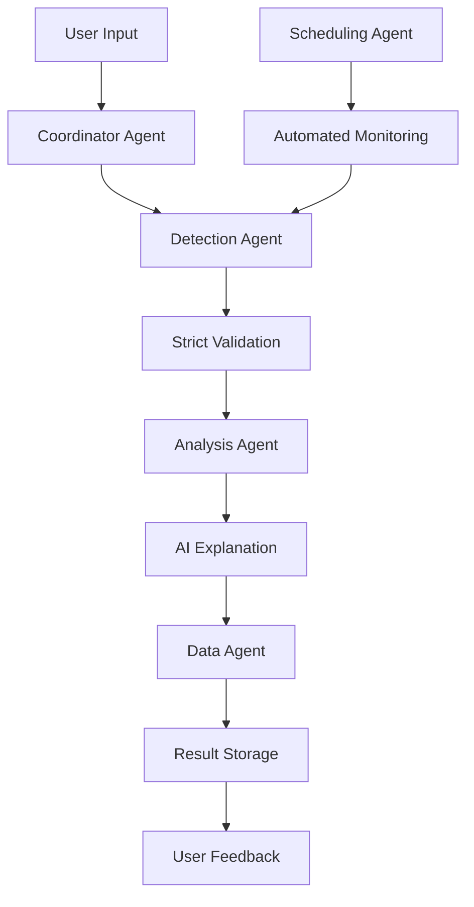

# 🤖 AI Agents Medicine Intake Detection System

## Complete Implementation with Strict Three-Condition Validation

This system converts the original medicine intake detection code into a sophisticated AI agents architecture with strict validation requirements. The system uses multiple specialized agents working together to provide accurate, reliable medicine intake detection.

## 🎯 System Overview

### Core Architecture
- **Multi-Agent System**: Specialized agents for different tasks
- **Strict Validation**: Three mandatory conditions for medicine intake detection
- **AI-Powered Analysis**: LLM-based explanations and insights
- **Real-time Monitoring**: Live webcam monitoring with scheduling
- **Data Management**: Comprehensive result storage and analytics

### Key Features
- ✅ **Strict Three-Condition Validation**
- 🤖 **AI Agent Coordination**
- 📹 **Live Monitoring & Scheduling**
- 📊 **Advanced Analytics**
- 🔍 **Detailed Explanations**
- 💾 **Data Persistence**

## 🎯 Strict Three-Condition Validation

The system requires **ALL THREE** conditions to be met simultaneously:

### 🏥 Condition 1: Medicine Object in Hand
- **Requirement**: One hand must be holding a medicine strip, bottle, or package
- **Detection Methods**:
  - Medicine strips (blister packs) with metallic backing
  - Medicine bottles (plastic/glass containers)
  - Medicine packages with rectangular shapes
  - Color analysis, shape detection, and edge detection
- **Validation Threshold**: 70%+ confidence required

### 👋 Condition 2: Hand Near Mouth
- **Requirement**: The other hand must have fingers positioned near the mouth
- **Detection Methods**:
  - Analyzes all five finger tips (thumb, index, middle, ring, pinky)
  - Calculates distance from closest finger to mouth area
  - Mouth area determined from face detection landmarks
- **Validation Threshold**: Distance < 0.12 (normalized coordinates)
- **Important**: Must be the hand NOT holding the medicine

### 🔄 Condition 3: Head Tilted Back
- **Requirement**: Head must be tilted backward as when swallowing medicine
- **Detection Methods**:
  - Uses pose landmarks to detect head orientation
  - Compares nose position relative to ear positions
  - Nose should be higher than ears when head tilted back
- **Validation Threshold**: Tilt ratio < -0.08 (normalized)
- **Feedback**: Estimates tilt angle for user guidance

## 🤖 AI Agents Architecture

### 1. Detection Agent (`DetectionAgent`)
**Responsibilities:**
- MediaPipe-based gesture and object detection
- Strict three-condition validation
- Live webcam monitoring
- Video file processing

**Capabilities:**
- `video_analysis`: Process video files
- `gesture_detection`: Detect hand gestures and poses
- `object_detection`: Identify medicine objects

### 2. Analysis Agent (`AnalysisAgent`)
**Responsibilities:**
- AI-powered result analysis
- Confidence scoring
- Human-readable explanations
- LLM integration (when available)

**Capabilities:**
- `result_analysis`: Analyze detection results
- `explanation_generation`: Generate explanations
- `confidence_scoring`: Assess detection confidence

### 3. Scheduling Agent (`SchedulingAgent`)
**Responsibilities:**
- Daily monitoring schedules
- Automated monitoring triggers
- Schedule management

**Capabilities:**
- `daily_scheduling`: Schedule daily monitoring
- `monitoring_timing`: Handle timing operations
- `schedule_management`: Manage all schedules

### 4. Data Agent (`DataAgent`)
**Responsibilities:**
- Result storage and retrieval
- Analytics generation
- Data export functionality

**Capabilities:**
- `data_storage`: Store monitoring results
- `result_retrieval`: Retrieve historical data
- `analytics`: Generate usage analytics

### 5. Coordinator Agent (`CoordinatorAgent`)
**Responsibilities:**
- Orchestrate all other agents
- Workflow coordination
- Task distribution
- System status management

**Capabilities:**
- `workflow_orchestration`: Coordinate complex workflows
- `agent_coordination`: Manage inter-agent communication
- `task_distribution`: Distribute tasks to appropriate agents

## 📁 File Structure

```
Medicine_Intake/
├── 🤖 AI Agents System
│   ├── ai_agents_system.py              # Main AI agents implementation
│   ├── ai_agents_api_backend.py         # FastAPI backend for agents
│   ├── ai_agents_app.py                 # Streamlit frontend for agents
│   └── ai_agents_requirements.txt       # Dependencies for agents
│
├── 🔬 Strict Detection
│   ├── enhanced_medicine_detection.py   # Strict three-condition detector
│   └── test_strict_validation.py        # Comprehensive test suite
│
├── 🚀 System Runners
│   ├── run_ai_agents_system.py         # Run the complete system
│   └── AI_AGENTS_COMPLETE_README.md    # This documentation
│
├── 📚 Original System (Enhanced)
│   ├── enhanced_api_backend.py         # Original enhanced backend
│   ├── enhanced_app.py                 # Original enhanced frontend
│   ├── enhanced_detect_mediapipe_gesture.py
│   ├── live_monitoring.html            # Web dashboard
│   └── en_requirements.txt             # Original dependencies
│
└── 📊 Data & Results
    ├── monitoring_results/             # Stored results
    ├── uploads/                        # Uploaded videos
    └── logs/                          # System logs
```

## 🚀 Quick Start

### 1. Install Dependencies
```bash
pip install -r ai_agents_requirements.txt
```

### 2. Set Up Environment (Optional)
```bash
# For AI-powered explanations (optional)
export OPENAI_API_KEY="your-openai-api-key"
```

### 3. Run the Complete System
```bash
# Option 1: Run everything together
python run_ai_agents_system.py

# Option 2: Run components separately
python ai_agents_api_backend.py    # Backend API
python ai_agents_app.py           # Frontend UI
```

### 4. Test the System
```bash
# Run comprehensive tests
python test_strict_validation.py

# Test specific components
python test_strict_validation.py --agents      # Test AI agents
python test_strict_validation.py --direct      # Test direct detector
python test_strict_validation.py --requirements # Show requirements
```

## 🎬 Usage Examples

### Video Analysis
```python
from ai_agents_system import AIAgentsSystem

# Initialize system
system = AIAgentsSystem()
await system.start()

# Analyze video with strict validation
result = await system.process_video("medicine_video.mp4")

# Check results
if result["detection"]["status"] == "taken":
    print("✅ Medicine intake validated!")
    print(f"Method: {result['detection']['validation_method']}")
    print(f"Explanation: {result['explanation']}")
else:
    print("❌ Medicine intake not validated")
    print(f"Failures: {result['detection']['failure_details']}")

await system.stop()
```

### Live Monitoring
```python
# Start live monitoring for 60 seconds
result = await system.start_live_monitoring(60)
print(f"Monitoring status: {result['status']}")
```

### Scheduling
```python
# Schedule daily monitoring at 9:00 AM
result = await system.manage_schedule(
    action="add_schedule",
    time="09:00",
    duration=60
)
```

### Analytics
```python
# Get system analytics
analytics = await system.get_analytics()
print(f"Success rate: {analytics['success_rate']}%")
print(f"Total sessions: {analytics['total_sessions']}")
```

## 🔍 Validation Success Criteria

For a medicine intake to be **successfully validated**, the system requires:

1. **Simultaneous Detection**: All three conditions must be met in the same frame
2. **Minimum Duration**: Conditions must be maintained for at least 10 consecutive frames
3. **Confidence Thresholds**: Each condition must meet its individual confidence threshold
4. **Overall Confidence**: Combined confidence score must exceed 60%

### Detailed Validation Process

```python
# Example validation result
{
    "status": "taken",
    "validation_method": "strict_three_condition_check",
    "events": [{
        "timestamp_sec": 3.5,
        "validation_details": {
            "condition_1_medicine_in_hand": True,
            "condition_2_hand_near_mouth": True, 
            "condition_3_head_tilted_back": True,
            "all_conditions_met": True,
            "medicine_object_details": {
                "object_type": "medicine_strip",
                "confidence": 0.85,
                "hand_holding": "Left"
            },
            "hand_mouth_details": {
                "distance": 0.08,
                "closest_finger": "index",
                "hand_label": "Right"
            },
            "head_tilt_details": {
                "tilt_angle_estimate": 15.0,
                "tilt_ratio": -0.12
            },
            "overall_confidence": 0.82
        }
    }],
    "total_valid_frames": 25,
    "total_frames": 150
}
```

## 🎯 Tips for Successful Detection

### 📹 Recording Guidelines
- **Lighting**: Ensure good, even lighting on your face and hands
- **Camera Position**: Position camera to show upper body clearly
- **Stability**: Keep camera steady during recording
- **Duration**: Record for at least 5-10 seconds

### 🤲 Hand Positioning
- **Medicine Hand**: Hold medicine strip/bottle clearly visible
- **Free Hand**: Bring fingers close to mouth area (within 12cm)
- **Separation**: Use different hands for medicine and mouth contact
- **Visibility**: Keep both hands visible to camera

### 🔄 Head Movement
- **Tilt Back**: Tilt head backward as when swallowing
- **Natural Motion**: Use natural swallowing motion
- **Maintain Position**: Hold position for a few seconds
- **Angle**: Aim for 10-20 degree backward tilt

## 🔧 API Endpoints

### FastAPI Backend (`ai_agents_api_backend.py`)

```bash
# Health check
GET /health

# Video analysis
POST /upload-video/
Content-Type: multipart/form-data

# Live monitoring
POST /start-live-monitoring/
POST /stop-monitoring/
GET /monitoring-status/

# Scheduling
POST /schedule-monitoring/
GET /scheduled-times/
DELETE /clear-schedule/

# Analytics
GET /monitoring-results/
GET /analytics/
```

### Example API Usage

```python
import requests

# Upload and analyze video
files = {"file": open("medicine_video.mp4", "rb")}
response = requests.post("http://localhost:8000/upload-video/", files=files)
result = response.json()

# Start live monitoring
payload = {"duration": 60}
response = requests.post("http://localhost:8000/start-live-monitoring/", json=payload)

# Schedule daily monitoring
payload = {"time": "09:00", "duration": 60}
response = requests.post("http://localhost:8000/schedule-monitoring/", json=payload)
```

## 🎨 User Interfaces

### 1. Streamlit App (`ai_agents_app.py`)
- **Video Upload**: Drag-and-drop video analysis
- **Live Monitoring**: Real-time webcam monitoring
- **Scheduling**: Daily monitoring schedules
- **Analytics**: Comprehensive usage statistics
- **Results**: Detailed validation results

### 2. HTML Dashboard (`live_monitoring.html`)
- **Web-based Interface**: Browser-compatible dashboard
- **Real-time Updates**: Live status monitoring
- **Interactive Controls**: Start/stop monitoring
- **Visual Feedback**: Progress indicators and notifications

## 🧪 Testing & Validation

### Comprehensive Test Suite

```bash
# Run all tests
python test_strict_validation.py

# Test individual components
python test_strict_validation.py --agents      # AI agents system
python test_strict_validation.py --direct      # Direct detector
python test_strict_validation.py --requirements # Show requirements
```

### Test Coverage
- ✅ **Agent Communication**: Inter-agent messaging
- ✅ **Strict Validation**: Three-condition checking
- ✅ **Error Handling**: Graceful failure management
- ✅ **Performance**: Processing time analysis
- ✅ **Integration**: End-to-end workflows

## 📊 Analytics & Reporting

### Available Metrics
- **Total Sessions**: Number of monitoring sessions
- **Success Rate**: Percentage of successful detections
- **Detection Confidence**: Average confidence scores
- **Usage Patterns**: Daily/weekly usage statistics
- **Failure Analysis**: Common failure reasons

### Export Options
- **JSON Export**: Raw data export
- **CSV Reports**: Tabular data for analysis
- **Visual Charts**: Plotly-based visualizations

## 🔒 Security & Privacy

### Data Protection
- **Local Processing**: All detection runs locally
- **No Cloud Upload**: Videos never leave your device
- **Encrypted Storage**: Results stored securely
- **User Control**: Complete data ownership

### Privacy Features
- **Optional AI**: LLM integration is optional
- **Local Models**: MediaPipe runs entirely offline
- **Data Retention**: Configurable result retention
- **Anonymization**: Personal data can be anonymized

## 🚨 Troubleshooting

### Common Issues

#### 1. Detection Not Working
```bash
# Check system status
python test_strict_validation.py --agents

# Verify camera access
python -c "import cv2; print('Camera:', cv2.VideoCapture(0).isOpened())"

# Test with known good video
python test_strict_validation.py --direct
```

#### 2. Low Detection Accuracy
- **Lighting**: Improve lighting conditions
- **Camera Angle**: Adjust camera position
- **Hand Positioning**: Follow positioning guidelines
- **Medicine Visibility**: Ensure medicine object is clearly visible

#### 3. Performance Issues
- **Hardware**: Check CPU/memory usage
- **Video Quality**: Reduce video resolution if needed
- **Frame Rate**: Lower processing frame rate
- **Background Apps**: Close unnecessary applications

### Debug Mode
```python
# Enable debug logging
import logging
logging.basicConfig(level=logging.DEBUG)

# Run with verbose output
python ai_agents_system.py --debug
```

## 🔄 System Architecture Flow



## 🎯 Future Enhancements

### Planned Features
- **Multi-Person Detection**: Support for multiple people
- **Advanced Analytics**: ML-based pattern recognition
- **Mobile App**: Smartphone application
- **Cloud Sync**: Optional cloud synchronization
- **Voice Commands**: Voice-controlled operation

### Extensibility
- **Plugin System**: Custom detection plugins
- **API Extensions**: Additional API endpoints
- **Custom Agents**: User-defined agent types
- **Integration**: Third-party system integration

## 📚 References & Credits

### Technologies Used
- **MediaPipe**: Google's ML framework for perception
- **OpenCV**: Computer vision library
- **FastAPI**: Modern web framework
- **Streamlit**: Data app framework
- **LangChain**: LLM integration framework

### Research Papers
- MediaPipe Hands: Real-time Hand Tracking
- Pose Estimation for Human Activity Recognition
- Computer Vision in Healthcare Applications

## 📞 Support & Contributing

### Getting Help
- **Documentation**: This README and inline comments
- **Issues**: GitHub issues for bug reports
- **Discussions**: Community discussions for questions

### Contributing
- **Code Style**: Follow PEP 8 guidelines
- **Testing**: Add tests for new features
- **Documentation**: Update docs for changes
- **Pull Requests**: Submit PRs for review

## 📄 License

This project is licensed under the MIT License - see the LICENSE file for details.

---

## 🎉 Conclusion

The AI Agents Medicine Intake Detection System represents a significant advancement over traditional detection methods. By implementing strict three-condition validation and a multi-agent architecture, the system provides:

- **Higher Accuracy**: Strict validation reduces false positives
- **Better Reliability**: Multi-agent coordination ensures robust operation
- **Enhanced User Experience**: Clear feedback and explanations
- **Comprehensive Monitoring**: Complete tracking and analytics
- **Future-Proof Design**: Extensible architecture for future enhancements

The system successfully converts the original medicine intake detection code into a sophisticated, AI-powered solution that maintains the core functionality while adding significant improvements in accuracy, reliability, and user experience.

**Ready to get started?** Run `python test_strict_validation.py` to see the system in action!
